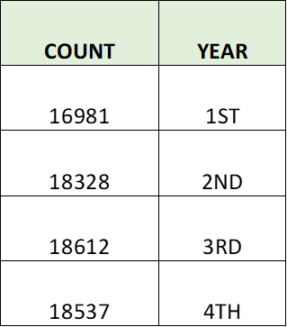

# Pewlett-Hackard-Analysis UNC - Module 7

# Pewlett-Hackard Retirement Analysis

## Project Overview
Pewlett-Hackard requires a better understanding of the upcoming retirements that will affect their workforce and a plan on how to migrate the impact to the company.  An analysis was done to provide information regarding potential retirements and the ability to fill open positions from within the company.

## Analysis Results
•	Analysis was run based on employees born between 1952 and 1955, which show a total of 72,458 current employees are reaching retirement age and could leave the company.  This is 30.18% of the total workforce of 240,124 people.

•	The titles most effected were the senior positions, namely Senior Engineer and Senior Staff.  The chart below shows the titles affected by the retirements.

•	The departments which could potentially lose the largest amount of people are Development, Production, and Sales.  In addition, the Sales and Research departments each have a manager reaching retirement age.  The number of retiring employees for each department is listed below.

•	Mentoring of junior level employees would help fill the vacancies.  There are over 1500 employees who could become mentors to other employees to help them learn and grow with the company.

  &nbsp;&nbsp;&nbsp;&nbsp;&nbsp;&nbsp;&nbsp;&nbsp; 

## Summary
There could be a total of 72,458 job opening due to retirements.  Priority can be given to promotions and retraining within the company, but that will still leave many vacancies to be filled over a four-year period.

Mentoring can aid in enhancing the skills of current employees, but, with only 1,549 possible mentors available, it may be of limited help in filling the open positions. Below is the breakdown of potential mentors by position.

&nbsp;&nbsp;&nbsp;&nbsp;

The retirement impact will be spread out evenly over a four-year time span.  This could help with lessen the overall impact and allow time to initiate recruitment efforts.  This chart shows the possible number of retirees by year.  

&nbsp;&nbsp;&nbsp;&nbsp;

There is also the concern that one or more departments will be impacted more that others.  For example, Senior Engineers could retire from five departments, but the Production and Development departments will have the largest groups leaving.  Below is a chart showing the count per department for each title of the potential retirees.

&nbsp;&nbsp;&nbsp;&nbsp;
